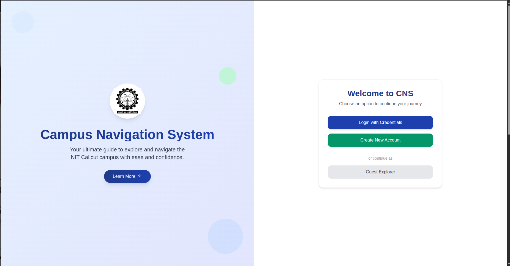
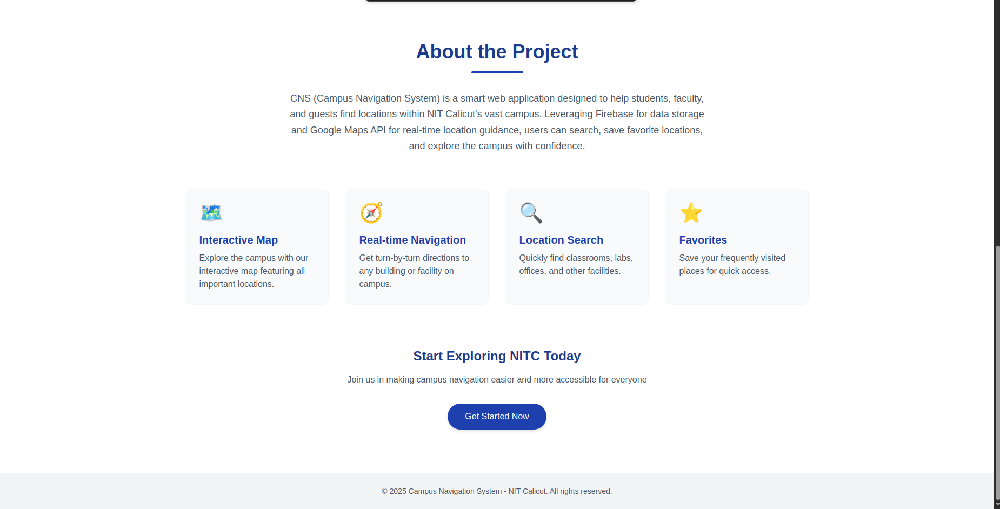
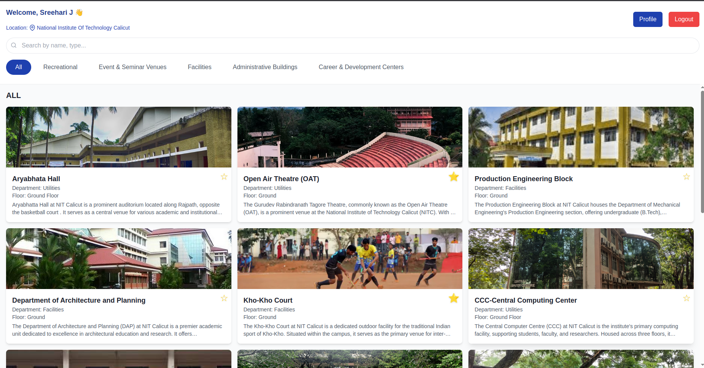
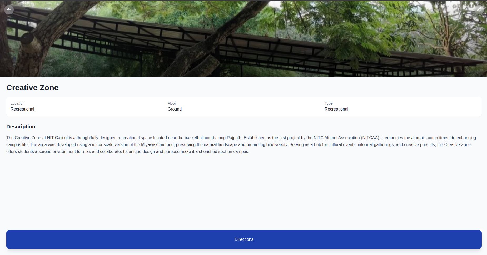
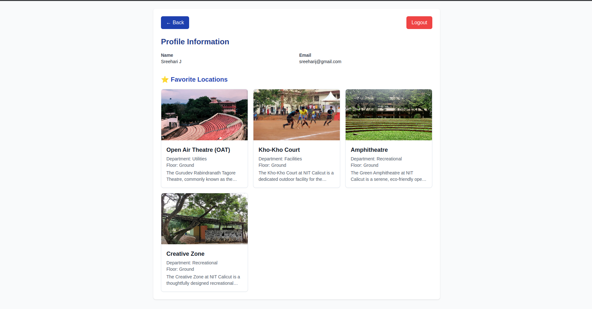
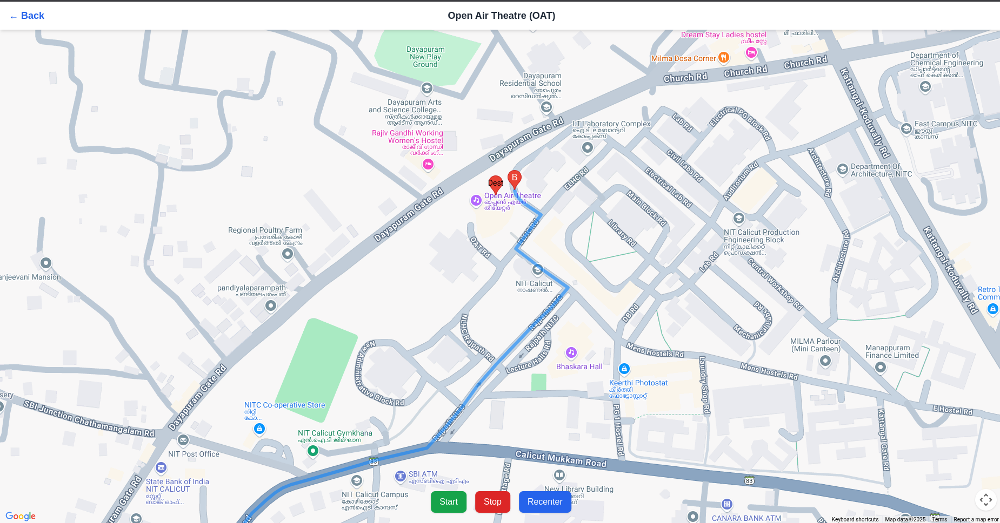

# 🧭 Campus Navigation System – NIT Calicut

Welcome to the **Campus Navigation System** – a web application built to help students, staff, and visitors easily navigate the NIT Calicut campus. This project leverages modern web technologies to offer interactive maps, real-time directions, and detailed location data.

[🌐 Visit Live Site](https://campusnavigationsystem.netlify.app/)

---

## 🚀 Tech Stack

- **Frontend**: React.js
- **Backend**: Firebase Firestore & Firebase Storage
- **Maps Integration**: Google Maps API
- **Styling**: Tailwind CSS
- **Hosting**: Netlify

---

## ✨ Features

- 🔍 **Searchable Locations** – Easily find departments, hostels, labs, and other campus facilities.
- 🗺️ **Interactive Map** – View buildings on Google Maps and get precise directions.
- 🧭 **Navigation Assistance** – Real-time path rendering from your current location to your destination.
- 📂 **Location Management** – Admins can upload, update, and maintain place details using Firebase.

---

## 📸 Interface Preview

Below are some handpicked screenshots that demonstrate the application's functionality and design:

### 🖼️ Highlights

| HomePage | About Section |
|--------------|--------------|
|  |  |

| Dashboard | Details Page |
|--------------|--------------|
|  |  |

| Profile Page | Map View |
|--------------|--------------|
|  |  |

---

## 🙌 Contributing

Feel free to submit issues or pull requests if you have improvements or ideas to share!

---

## 📄 License

This project is open source and available under the [MIT License](LICENSE).

